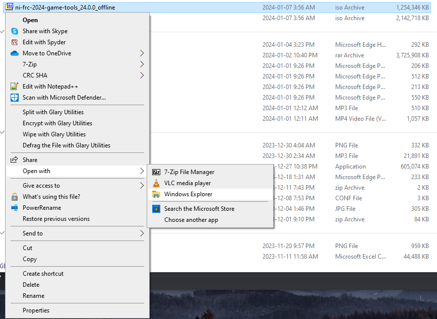
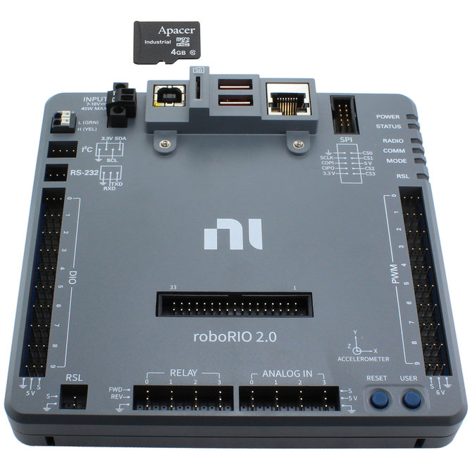
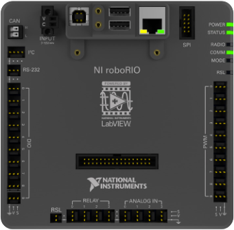

# frc2024

| Branch  | Status                                                                                                                                                                         |
| ------- | ------------------------------------------------------------------------------------------------------------------------------------------------------------------------------ |
| main    | [](https://github.com/sonic-howl/frc2024/actions/workflows/integrate.yml)    |
| develop | [](https://github.com/sonic-howl/frc2024/actions/workflows/integrate.yml) |

## Getting started

### Installing FRC Game Tools

To install FRC's game tools for 2024, follow [this guide](https://docs.wpilib.org/en/stable/docs/zero-to-robot/step-2/frc-game-tools.html).

> Note: If you're on windows and you don't see the mount option after right clicking the iso file, you can open the file using `Open with` then `Windows Explorer`.
>
> 

Once installed, you'll have access to these tools:

- LabVIEW Update
- FRC Driver Station
- FRC roboRIO Imaging Tool and Images

### Installing WPILib 2024 (Python)

To install the 2024 WPILib programming environment for python, follow [this guide](https://docs.wpilib.org/en/stable/docs/zero-to-robot/step-2/python-setup.html).

If you're unsure of what options to choose during the install, follow these steps:

#### Installing Python

To get started, install python version 3.12.1 from these links and run the installer:

**[Windows](https://www.python.org/ftp/python/3.12.1/python-3.12.1-amd64.exe)**

> **Installation Steps**
>
> 1.  Select Modify
> 2.  Click Next
> 3.  Select `Associate files with Python` then click install

---

**[MacOS](https://www.python.org/ftp/python/3.12.1/python-3.12.1-macos11.pkg)**

#### Install VSCode

Follow the instructions [here](https://code.visualstudio.com/download) to install VSCode.

#### Extra Step on Windows

If you're on Windows, install this [Visual Studio package](https://aka.ms/vs/17/release/vc_redist.x64.exe) by downloading and running the installer.

#### Getting Started with VSCode

If you're new to VSCode, WPILib's docs have a good [starting guide](https://docs.wpilib.org/en/stable/docs/software/vscode-overview/vscode-basics.html#visual-studio-code-basics-and-the-wpilib-extension) explaining the basics.

### Cloning the GitHub Repository

In order to gain access to the robot code, clone the [Sonic Howl frc2024 repo](https://github.com/sonic-howl/frc2024).

If you don't know how to do this, follow these steps:

1. Open the repository [link](https://github.com/sonic-howl/frc2024) in your browser
2. Ask one of the organization admins to add you to the repo. (Neil, Nathan, Ramez). **TODO: Not sure if this is needed is repo is public. Update this section after testing.**
3. Click on the `<Code>` button, choose HTTPS and copy the link to your clipboard.
4. Launch the `2024 WPILib VS Code` application.
5. Open the terminal by pressing the `CTRL + ~` keys.
6. Enter the command `git clone "the link you copied"`

> If you get an error mentioning that git isn't installed (or that no command named git exists), download it [here](https://git-scm.com/downloads).

### Installing RobotPy and Dependencies

Run the appropriate command in terminal depending on you operating system to install the project's dependencies.

**For Windows**

```bash
py -3 -m pip install robotpy
```

```bash
py -3 -m robotpy sync
```

**For Linux and macOS**

```bash
pip install robotpy
```

```bash
robotpy sync
```

### Installing Formatter and Linter

This project uses [ruff](https://docs.astral.sh/ruff/) to provide formatting and linting capabilities.

> **Note:** There's currently an error with the `pyproject.toml` file's requirements where it isn't able to locate and install `ruff`. Instead, we'll install it manually in the upcoming steps.

To install ruff, run:

```bash
# Windows
py -3 -m pip install ruff

# Linux
pip install ruff
```

---

You can also integrate ruff in VsCode by installing the `ruff` extension.

To configure the ruff VsCode extension, follow these steps:

1. Create a folder called `.vscode`
2. Create a file in this folder named `settings.json`
3. Copy these settings in the file:

```json
{
  "[python]": {
    "editor.formatOnSave": true,
    "editor.codeActionsOnSave": {
      "source.organizeImports": true
    },
    "editor.defaultFormatter": "charliermarsh.ruff"
  }
}
```

## Configuring Hardware

In order to complete these steps, you will need to [install the FRC Game Tools](#installing-frc-game-tools).

### RoboRIO Image Update

The frc 2024 season will require all RoboRIOs to be flashed with a new image. To update the RoboRIOs, please follow the [guide](https://docs.wpilib.org/en/stable/docs/zero-to-robot/step-3/index.html) depending on what version of RIO you have.

[**RoboRIO 2.0**](https://docs.wpilib.org/en/stable/docs/zero-to-robot/step-3/roborio2-imaging.html)



---

[**RoboRIO 1.0**](https://docs.wpilib.org/en/stable/docs/zero-to-robot/step-3/imaging-your-roborio.html)



### Install RobotPY on RoboRIO

Follow [this guide](https://robotpy.readthedocs.io/en/stable/install/robot.html) to install python and RobotPY on the RobotRIO.

### Programming the Radio

Similar to the RoboRIO, the radio used to communicate with the bot must also be flashed with the latest firmware. Follow [this guide](https://docs.wpilib.org/en/stable/docs/zero-to-robot/step-3/radio-programming.html) to do so.

## Build and Deploy Commands

To view all available robotpy commands, use the following command:

```bash
# Linux
python3 -m robotpy

# Windows
py -3 -m robotpy
```

> You can pass the `--help` argument to see more information about the subcommand.
>
> For example, to see help for the sim command you can do the following:
>
> ```bash
> # Linux
> python3 -m robotpy sim --help
>
> # Windows
> py -3 -m robotpy sim --help
> ```

### Running Robot Code

In order to run the robot code, use the following command:

```bash
# Windows
py -3 robot.py

# Linux
python3 robot.py
```

> See full guide on running robot code [here](https://robotpy.readthedocs.io/en/stable/guide/running.html)

### Formatting Code

The following command can be used to format the code:

```bash
ruff format
```

When code is pushed to the repository, a workflow will be run to check if the code is properly formatted. If it isn't, you won't be able to merge the code. In order to check if the project is properly formatted, run:

```bash
ruff format --check
```

> A pre-commit hook will also automatically check this for you. If the files aren't formatted correctly, you won't be able to commit.

### Linting Code

Code linting is like a grammar check for your code. It helps find mistakes and keeps your code neat and consistent, making it easier to read and understand.

To run the linting check, use the following command:

```bash
ruff check .
```

### Using the Driver Station

This [guide](https://docs.wpilib.org/en/stable/docs/zero-to-robot/step-4/running-test-program.html) shows you how to setup the frc driver station in order to run your test programs.

### Deploying Code to Robot

You can deploy robot code to a robot you're connected to using:

```bash
# Windows
py -3 robot.py deploy

# Linux
python3 robot.py deploy
```

> See full guide on deploying robot code [here](https://robotpy.readthedocs.io/en/stable/guide/deploy.html)

## Simulation Testing

WPILib provides a [simulator](https://docs.wpilib.org/en/stable/docs/software/wpilib-tools/robot-simulation/introduction.html) to test your code without being physically connected to a robot.

### Running the Robot Simulation

A robot simulation is available for testing. Read the full documentation [here](https://docs.wpilib.org/en/stable/docs/software/wpilib-tools/robot-simulation/introduction.html).

You can run it with the following command:

```bash
# Windows
py -3 -m robotpy sim

# Linux and macOS
python3 -m robotpy sim
```

### Running Robot Dashboards during a Simulation

Follow [this guide](https://docs.wpilib.org/en/stable/docs/software/wpilib-tools/robot-simulation/introduction.html#running-robot-dashboards) to enable whichever dashboard you plan on using during the simulation.

### Run Tests

You can also manually run unit tests using:

```bash
# Windows
py -3 robot.py test

# Linux
python3 robot.py test
```

> See full unit testing documentation [here](https://robotpy.readthedocs.io/en/stable/guide/testing.html)
